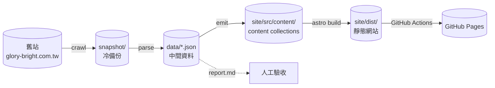

# 榮輝照明靜態官網

Astro 靜態型錄網站，產品資料自舊站 `www.glory-bright.com.tw` 遷移而來。
發布於 <https://jacklee814.github.io/glory-bright/>。

目前收錄 **194 件產品**（137 件燈具、57 件開關面板）、27 個分類，以及 372 張 WebP 圖片（346 張產品圖、22 張分類封面、4 張首頁輪播）。

## 專案架構

pnpm workspace 分成三個區塊：一次性的資料遷移工具、兩者共用的資料契約，以及最終發布的網站。

```text
glory-bright/
├── tools/scraper/      # 舊站資料遷移 pipeline（一次性，資料已匯入完成）
├── shared/             # scraper 與 site 共用的資料契約
├── site/               # Astro 靜態網站
└── .github/workflows/  # GitHub Pages 自動部署
```

資料的流向是單向的 —— 舊站爬下來之後，經過解析、驗證，最後寫成 Astro 的 content collections：



**只有 `crawl` 會連線舊站。** `parse` 與 `emit` 完全離線，所以解析規則可以反覆調整而不必重新爬站 —— 這對只支援 HTTP、且會對來源 IP 限流的 Apache 1.3.39 主機很重要。

## 資料遷移 pipeline

```text
tools/scraper/src/
├── http.ts           # 節流 HTTP client（以 curl 為傳輸層）
├── urls.ts           # URL 組裝與 snapshot 檔名
├── taxonomy.ts       # 舊站分類 → 新站分類的對照表
├── crawl.ts          # ① 抓取舊站存成 snapshot
├── labels.ts         #   規格標籤正規化與別名
├── parse-light.ts    #   燈具明細頁解析
├── parse-switch.ts   #   開關列表頁解析
├── covers.ts         #   分類封面圖解析
├── parse.ts          # ② snapshot → data/*.json
├── report.ts         #   人工驗收報告
├── images.ts         #   Sharp 轉 WebP
└── emit.ts           # ③ data → content collections + 圖片
```

三個指令對應 pipeline 的三個階段：

```bash
pnpm --filter scraper crawl   # 舊站 → snapshot（唯一會連線的階段）
pnpm --filter scraper parse   # snapshot → data/*.json + report.md
pnpm --filter scraper emit    # data → site/src/content/ + site/public/
pnpm --filter scraper test    # 48 個測試，fixture 直接取自 snapshot
```

### 為什麼傳輸層用 curl 而非 fetch

舊站的 Apache 1.3.39 送出的 chunked encoding 不符 HTTP/1.1 規範，Node 的 undici 會以 `Invalid character in chunk size` 中止連線並丟出 `TypeError: terminated`。curl 對此較寬容，能完整取回內容。

另外該主機會在請求過密時回傳 HTTP 200 但內容是 `wfs.hinet.net` 攔截頁。`isInterceptPage()` 會偵測並視為失敗，絕不會把攔截頁寫進 snapshot。

## 網站

```text
site/src/
├── content/
│   ├── config.ts                    # 重用 shared/schema.ts
│   └── products/<分類路徑>/
│       ├── _category.json           # 分類名稱、排序、封面圖
│       └── <型號slug>/index.json    # 產品
├── layouts/BaseLayout.astro
├── components/
│   ├── Header.astro                 # 導覽 + 型號即時搜尋
│   ├── Hero.astro                   # 首頁自動輪播
│   ├── CategorySidebar.astro        # 左側三層分類樹
│   ├── ProductGrid.astro
│   ├── ProductCard.astro
│   └── Footer.astro
├── pages/
│   ├── index.astro                  # 首頁：只有輪播
│   ├── products/index.astro         # 第一層分類
│   ├── products/[...slug].astro     # 分類逐層瀏覽 → 葉節點列產品
│   └── p/[model].astro              # 產品頁（扁平型號 URL）
├── lib/{catalog,url}.ts
└── styles/global.css
```

### 路由

| 路徑 | 內容 |
| --- | --- |
| `/` | 首頁情境輪播 |
| `/products/` | 第一層分類（燈具、開關面板） |
| `/products/lights/downlight/` | 子分類（MR16型、AR111型…） |
| `/products/lights/downlight/mr16/` | 葉節點，列出產品 |
| `/p/{型號}/` | 產品頁，型號 URL 維持扁平 |

分類路由是階層式的，產品 URL 則刻意扁平 —— 產品換分類時網址不會變。

### 資料契約

`shared/schema.ts` 同時被 scraper 的 `emit` 與 Astro 的 content collections 使用，所以任一側的欄位變更都會在建置時被另一側檢查到。

```ts
productSchema = { kind, model, images, order }
categorySchema = { name, order, cover?, description? }
```

產品只保留網站實際需要的四個欄位。舊站的完整規格（功率、色溫、演色性、尺寸、非標準欄位等）仍完整保存在 `tools/scraper/data/*.json`，要恢復顯示只需在 schema 補回欄位、調整 `emit.ts` 後重跑。

## 開發

```bash
pnpm install
pnpm --filter site dev        # 預覽（注意路徑含 /glory-bright/）
pnpm build                    # 產生 site/dist
pnpm typecheck
```

Astro 的 `base` 是 `/glory-bright/`，站內連結與 public 圖片一律經 `siteUrl()` 包裝。

## 刻意排除的功能

不提供產品篩選、產品比較、電話／E-mail 詢價 CTA 與最新消息頁面 —— 這些是業主確認的範圍縮減，不是待辦事項。詳見 `docs/DECISIONS.md`。

## 相關文件

- `docs/HANDOVER.md` — 交接說明、上線前必補項目
- `docs/DECISIONS.md` — 設計決策與取捨理由
- `tools/scraper/report.md` — 資料驗收報告（標示需業主補齊的產品）
